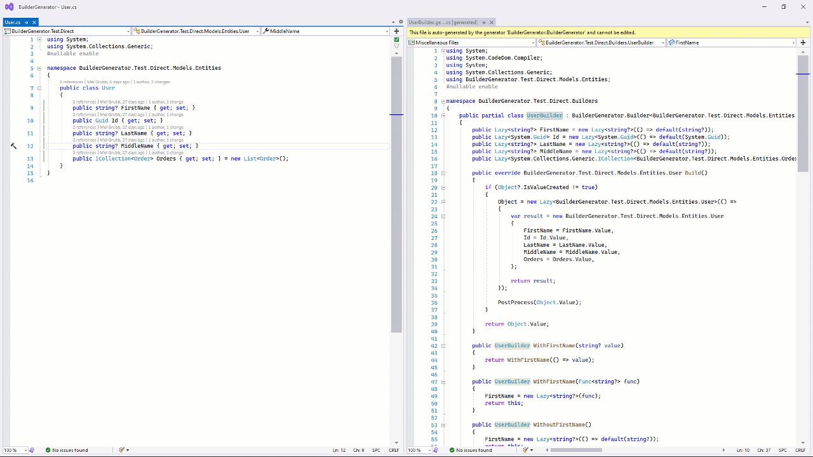

# BuilderGenerator

This NuGet package automates the generation of object builders for testing. It generates the repetitive part of creating builders, leaving only the more interesting, hand-curated parts for you to implement as partial classes.

With the v3.0 release, there are a few important breaking changes.

Support for .NET 6 & 7 has been dropped. The Builders now target .NET 8. If you have an older project that needs to remain on .NET 6 or 7, then it should keep using version 2 of BuilderGenerator.

Builders previously exposes an "Object" property and accompanying "WithObject" method to allow you to directly set the instance to be returned from the builder. This is not a common scenario. It's also uncommon for a class to have a property called "Object", but it _does_ occasionally happen. In version 3, this property and its With method are now named for the Builder's target class. A `FooBuilder` will now have a property called `Foo`, and a `WithFoo` method. Otherwise, this functionality is unchanged.

Builders now ignore properties marked with the `Obsolete` attribute by default, although this can be overridden in the `BuilderForAttribute` constructor if needed.

## Installation

Like all .Net [Source Generators](https://devblogs.microsoft.com/dotnet/introducing-c-source-generators/), BuilderGenerator is installed as an analyzer via [NuGet](https://www.nuget.org/packages/BuilderGenerator/). You can find it through the "Manage NuGet Packages" dialog in Visual Studio, or simply install it from the command line.

```ps
Install-Package BuilderGenerator
```

## What are Builders?

Builders provide a way to describe desired objects using a fluent syntax. They are commonly used to create test instances of classes for testing purposes, but they can be used to create real-world objects as well, although that is not as common. 

The majority of the time, test object builders will provide a set of well-known or "canned" objects through the use of static factory methods. For instance, a UserBuilder class may define an "Admin" method that returns a builder for an administrator account to be used as part of a test. Similarly, it may expose a "Customer" method that returns a builder for *that* specific kind of user.

The fluent syntax provided by the builder lets you take the result from one of these methods and further modify it before calling the "Build" method to create the final result. For a deeper explanation of the principles at work, please see my [Pluralsight course](https://app.pluralsight.com/library/courses/automated-testing-creating-maintainable-contexts/table-of-contents), but I'll try to summarize here as best I can.

The combination of the factory methods and fluent interface make it possible to write simple, expressive tests that clearly communicate their meaning by only mentioning the things that are important to the test. Consider the following typical test context setup. It creates a User object to be used by unit tests later on.

```csharp
var user = new User
{
    Id = Guid.NewGuid,
    FirstName = "Hiro",
    LastName = "Protagonist",
    Orders = new List<Order>
    {
        new Order
        {
            Id = Guid.NewGuid,
            Status = OrderStatus.Processing,
            OrderDate = DateTime.Today
        }
    }
}

var result = SomeMethod(user);
...
```

The problem here is that you can't tell which parts of that setup are relevant to the test. Is it important that the User has a single order? Would having two orders break the test? Is the user's name somehow important to this test, or can it be anything? Does it matter that the user's only order was created today and has a status of "Processing"? Another developer reading this test can't tell which details are important, and which are there merely to satisfy some restriction such as filling in required fields in order to silence validation errors.

Now look at the same example using a Builder.

```csharp
var user = UserBuilder.Typical()
    .WithFirstName("Hiro")
    .Build()

var result = SomeMethod(user);
...
```

Right away, a reader can tell that the user's first name must be important to this test. If not, it wouldn't have been mentioned, at least if you're "doing builders" right. The properties of the User instance might still be arbitrary, but we can be pretty sure that this test is going to be make some kind of assertion involving the user's first name. Perhaps the result of SomeMethod is a receipt or a report that should include that information. To be fair, the name of the test should have made this clear as well, but the point is that this test context isn't bogged down in the details of what make a User object valid anymore. It's only concerned with what makes this user *unique*. It's the "Typical" method's responsibility to define a valid User object.

Later on, if an additional field were added to the User object, and that new field was required, you could expect that change to break multiple tests. If each test built their own User instances from scratch, you'd have to fix each test context individually to include the new field. If those same tests were leveraging the UserBuilder class, however, you'd only need to fix the "Typical" method to include the new field and, generally-speaking, the tests should all pass again. Of course, if the new field somehow changes the behavior of the code in some important way, you might still be looking at some rework, but you'd have to do that in the non-builder example as well. Typically, Builders will allow you to skip over a lot of the noise of establishing a test context, and focus on what's actually relevant to that test.

## Usage

In order to generate a builder for a given class, simply create a partial class. For the "User" class, the builder would be called "UserBuilder" by convention. Decorate your partial builder class with the ```[BuilderFor]``` attribute.

```csharp
namespace MyTests.Builders
{
    [BuilderFor(typeof(User))]
    public partial class UserBuilder
    {
    }
}
```

The BuilderGenerator will handle the rest, creating the other half of the builder class, which handles all the repetitive, boring parts of creating a builder.

```csharp
namespace MyTests.Builders
{
    public partial class UserBuilder : BuilderGenerator.Builder<Entities.User>
    {
        public Lazy<string?> FirstName = new Lazy<string?>(() => default(string?));
        public Lazy<System.Guid> Id = new Lazy<System.Guid>(() => default(System.Guid));
        public Lazy<string?> LastName = new Lazy<string?>(() => default(string?));
        public Lazy<System.Collections.Generic.ICollection<BuilderGenerator.Sample.NuGet.Models.Entities.Order>> Orders = new Lazy<System.Collections.Generic.ICollection<BuilderGenerator.Sample.NuGet.Models.Entities.Order>>(() => default(System.Collections.Generic.ICollection<BuilderGenerator.Sample.NuGet.Models.Entities.Order>));

        public override BuilderGenerator.Sample.NuGet.Models.Entities.User Build()
        {
        ...
        }
    }
}
```

This class can be used on its own to create test object instances using a fluent syntax.

```csharp
var testUser = new UserBuilder()
    .WithId(Guid.NewGuid)
    .WithFirstName("Hiro")
    .WithLastName("Protagonist")
    .Build();
```

This Builder class will be updated live as you make changes to the source class.


Manually building the whole object using a builder offers very little over simply instantiating the object you want though. Apart from using a different syntax, it's not really doing anything useful. That's where factory methods come into play.

## Factory Methods

The builders are generated as partial classes. The generated half comprises the repetitive, boring part of the process, including the backing fields and "With" methods that provide the fluent builder syntax. It will not, however, contain any of the factory methods that are one of the cornerstones of the Builder pattern. These must be created by hand in *your* partial class file, the one that you decorated with the BuilderFor attribute. For example, this code creates a factory method called "Simple" in the hand-written partial class that fills in just the required fields.

```csharp
namespace MyTests.Builders
{
    [BuilderFor(typeof(User))]
    public partial class UserBuilder
    {
        public static UserBuilder Simple()
        {
            var builder = new UserBuilder()
                .WithId(Guid.NewGuid)
                .WithFirstName(Guid.NewGuid().ToString());
                .WithLastName(Guid.NewGuid().ToString());

            return builder;
        }
    }
}
```

You are free to use whatever naming conventions you want, but I have had good luck with naming one of the factory methods "Simple" or, in some cases, "Minimal". Its job is to create a builder for the simplest or most minimal object that will pass validation and can be saved to the database. This usually means filling in required fields, and any other fields needed to satisfy validation rules. Apart from being "valid", developers should not make any other assumptions about the contents of the object the builder will produce. I usually use some kind of random value generator to fill in those required values. In the example above, I'm using GUIDs.

You can derive new factory methods from existing ones in order to further refine or specialize the value being created. In the above example, UserBuilder.Simple set the Id, first and last names because they are required fields in our scenario, but the User class may have other properties that you'd expect to be filled in on any real-world user. You could easily build a second factory method on top of the Simple method to fill in these additional details. Let's create a "Typical" factory method that adds an order to the user's history.

```csharp
public static UserBuilder Typical()
{
    var builder = Simple()
        .WithOrders(new List<Order>
            {
                OrderBuilder.Simple().Build()
            });

    return builder;
}
```

Now your tests have both "Simple" and "Typical" users to choose from when creating a test context. These definitions can evolve over time as well. Maybe a "typical" user should have multiple orders in their history in varying stages of completion.

## Canned values

In addition to random-value methods like ```Simple``` or ```Typical```, you should also feel free to create factory methods for well-known, predictable values when they make sense. For instance, in an online store scenario, you might create a factory method to return specific products that are used as placeholders for testing.

If you are familiar with the concept of testing personas, you could create factory methods on UserBuilder to return User objects that correspond to those personas. For instance, you could create methods called "Bob" and "Fred" if those are names that mean something to your testing team. You could also create a method called "Admin", or "Customer" that would return you a randomly-generated User with certain known properties such as their user type, or roles in the system.

Once these factory methods have been defined, future test development can be accelerated. Instead of describing the user you need in detail, you just check the builder to see what you have "in stock". If what you need is there, then you've skipped ahead in creating your test context. If the builder doesn't have what you need, perhaps it has something close enough that you can tweak slightly to get what you want. At that point, you can decide whether your new canned value is specific enough that only your test will ever need it, or general enough to add a new factory method to be leveraged when writing the next set of tests.

## Resilient Test Contexts

Adding new orders to the object returned by UserBuilder.Typical should not break existing tests. If it does, then you're doing something wrong. If a test depends on some concrete fact about an object such as the User's first name, or the specific number of orders in their history, then that test needs to ensure that it controls that aspect of the context being built. It should specify the user's name if it matters, and it should populate the orders collection itself rather than depending on insider knowledge about the object returned from the builder. Builders are always subject to change as new features and requirements are added to the system.

Returning to the first example in this document:

```csharp
var user = UserBuilder.Typical()
    .WithFirstName("Hiro")
    .Build()

var result = SomeMethod(user);
...
```

I know that the test cares about the User's first name because it mentioned it. Every other aspect of that "Typical" user should be considered arbitrary. Their last name, how many orders they've ever placed, and other such details should not be depended on. Only the *documented* behavior of Typical should be counted on. Conversely, the Typical method should document what it is going to return. Can we assume that a typical User's status is "active"? That's probably a safe bet, but also one that the Typical method should have mentioned in its documentation. If the method doesn't promise it, don't depend on it.

## "With" Method Types

One feature of the generated builders is that the various "With" methods come in multiple flavors. There is the typical version that takes a simple value, such as the Guid Id value used in this example. In addition, there are overloads that take lambda expressions to be evaluated when the builder's Build method is finally invoked at runtime. This can be useful as a way to delay the execution of potentially expensive code until the last moment in case the value is changed later on. Each "With" method can be called multiple times, with subsequent values overwriting previous ones. In other words, "Last in wins". Builders represent a *plan* for creating an object rather than the object itself, and plans are always subject to change.

## Manipulating internal properties

Your objects may have internal properties that you expose to unit tests via the ```InternalsVisibleTo``` attribute. In order to manipulate these properties from the builders, you must explicitly tell the builder to expose them. In the ```BuilderFor``` attribute, add a second parameter with the value ```true``` or a named parameter called "includeInternals". This will tell that specific builder to include internal properties in addition to the public properties as it does now.

### Customizing the code templates

Custom code templates are currently on hold due to changes in the source generator mechanism that came with .net 6. The mechanism used by the previous ISourceGenerator interface is no longer present in the IIncrementalGenerator interface. If there is sufficient interest, and if the modern equivalent can be identified, I may revisit this in the future. It was only an experiment before, and easy enough to reproduce if needed. Otherwise, pull requests for new features and changes are welcome.
